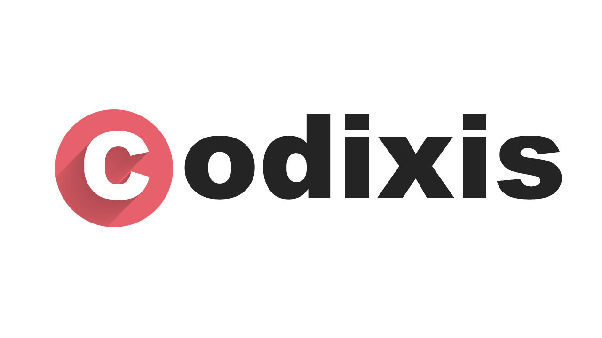

# 

Codixis Mac OS Dev Setup 
========
Use at your own risk :) 

## First steps ..
### Install editors & MAMP
``` bash
1. Download Sublime Text 
2. Download PHP Storm 9
3. Install MAMP PRO 2.2
>> Setup PHP storm for Symfony : https://confluence.jetbrains.com/display/PhpStorm/Getting+Started+-+Symfony+Development+using+PhpStorm
```

### Install Brew and composer 
``` bash
/usr/bin/ruby -e "$(curl -fsSL https://raw.githubusercontent.com/Homebrew/install/master/install)"
curl -s https://getcomposer.org/installer | php
sudo mv composer.phar /usr/local/bin/composer
```

### Install browser and virtualbox 
``` bash
1. virtual box 
2. firefox
3. opera
4. chrome 
```

### Install Axure 6 
``` bash
Old version of Axure from their website 
```

### Install mobile dev environment 
``` bash
1. phonegap

brew update
brew install node
sudo npm install -g phonegap

2. gapdebug
3. android sdk
4. cordova

sudo npm install -g cordova
brew install ant
brew install imagemagick

5. xcode (create an iTunes account with your e-mail) 

```

### Database software
``` bash
1. sql workbench
2. skipper
```

### Misc
``` bash
brew install imagemagick
brew install ffmpeg
```

